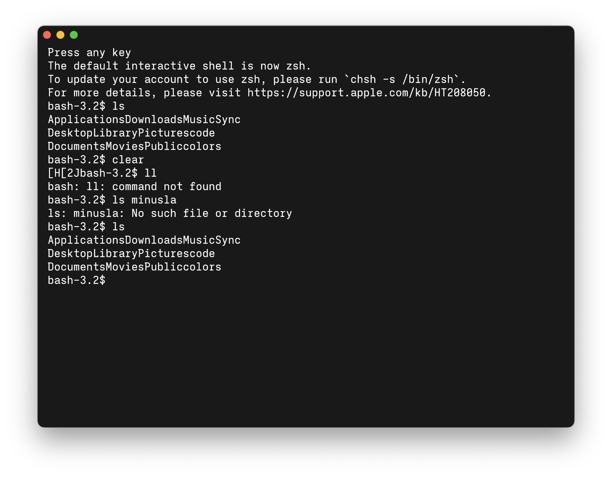
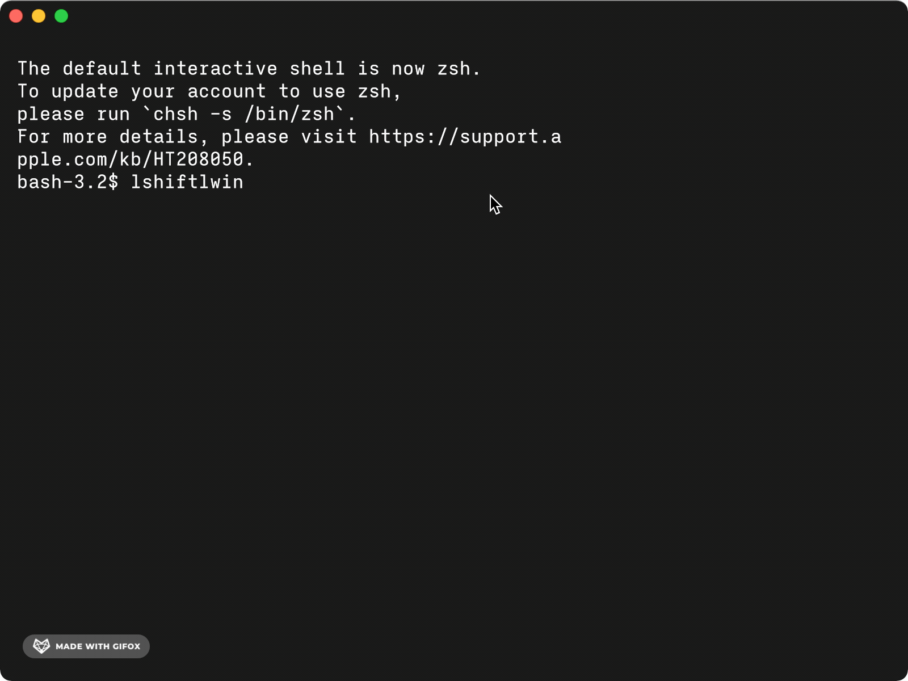
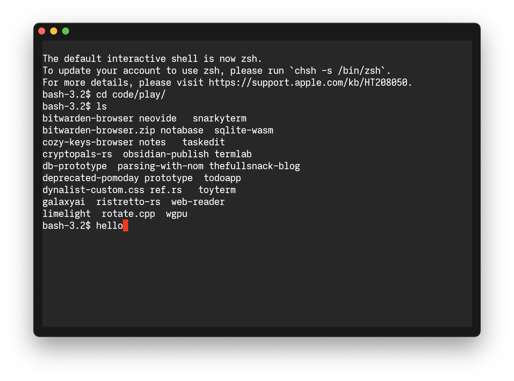
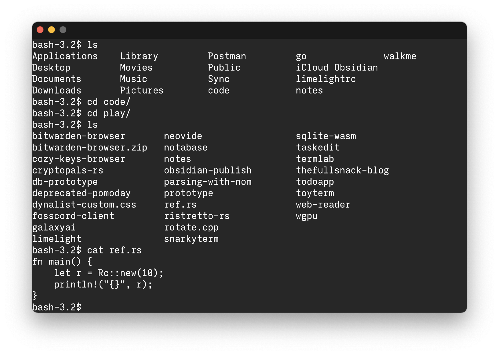
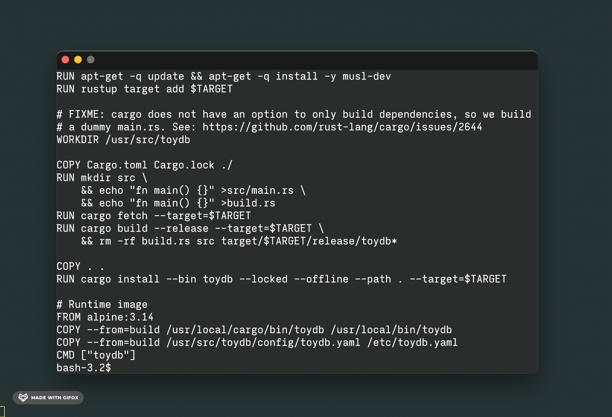

# Oct 4th, 2021
Started working on a prototype of a terminal emulator, the first part is to get a window opened
and render stuff on its surface. With the help of `wgpu` and `wgpu_glyph`, it's a piece of cake.

The problem is when I started a `pty` pair, the whole application choke because I tried to read from
`ptm` right in the event loop. Can't handle it differently because I don't have a proper
architecture.

# Oct 5th, 2021



Finally I managed to build a better architecture for the app, it's now have 2 different module
to handle two different stuff: `AppFrontend`, solely for rendering, and `AppBackend` to handle
the creation and communication with the `ptm`.

Line break and spacing characters are not handled. The performance is horrible when it come to
receiving user's input. I'm not sure if I should write to `ptm` every keystroke or not,
but I guess that's how it should. So the problem must be with the way I render a single big ass
text buffer to the screen.

[2dc54bc](https://github.com/huytd/snarkyterm/commit/2dc54bc40d085e1367fbf67b012b3eaa54e993d6)

# Oct 6th, 2021



After seeing my screenshot, friend of mine showed me a version of his own terminal emulator
([mos/terminal](https://github.com/MQuy/mos/tree/master/src/apps/terminal)), I know what you're
thinking, yes, making a terminal emulator is just a trivial thing that people do these days in
their free time.

Well, that helped me a lot. Turned out writing every key stroke to `ptm` is the right thing
to do. But the most important thing is to render the text buffer as an actual character grid.

That's easy. So I came up with a rough implementation just to see how it actually works. I also
passing a raw buffer from `AppBackend` to `AppFrontend` instead of converting them on every event.

The performance improved a lot! And another problem just popped up, how to handle control characters?

I mean, where should I handle it, in `AppBackend` or `AppFrontend`? And I think I need an actual
`Cursor`.

[bd9d4a5](https://github.com/huytd/snarkyterm/commit/bd9d4a5)

# Oct 7th, 2021
Not much progress for today, I built a key code to character mapping, so the terminal can now
send proper characters to the `ptm`. It can handle things like `Ctrl + C` as well as the tab complete! Yay.

Some keys still not being handled, like the Fn row or the Home/End/PgUp/PgDown keys.

Next is to handle some control characters when reading back from `ptm`.

Btw, terminal exit command now being handled properly.

[acfaee9](https://github.com/huytd/snarkyterm/commit/acfaee9)

# Oct 8th, 2021



Some update to the module names for better understanding and organization:

- **Shell:** It was `AppBackend`, is the module that hold the `pty` pair, send commands to `ptm` and read from `ptm`.
- **Terminal:** It was `AppFrontend`, is the module that provide display and most of the interaction.
- **Cursor:** The cursor in the terminal, new characters coming from the Shell/`ptm` will be inserted at cursor position.
- **Characters:** The module provide some utilities to work with characters, like translate key code to input chars,...

```
┌────────┐        ┌──────────────────┐
│  ptm   │◀──────▶│  device::Shell   │
└─┬────▲─┘        └──────┬────▲──────┘
  │    │               read   │
┌─▼────┴─┐               │  write
│  pts   │        ┏━━━━━━▼━━━━┻━━━━━━┓
├────────┤        ┃ winit::EventLoop ┃
│ $SHELL │        ┗━━━━━━━━┳━━━━━━━━━┛
└────────┘                 │udpate
                           │
                  ┌────────▼─────────┐
                  │terminal::Terminal│
                  └─────┬────────────┘
                        │
                  ┌─────▼────┐
                  │  Cursor  │
                  ├──────────┴────┐
                  │ CharacterGrid │
                  └───────────────┘
```

Howerver, the current implementation not really using any cursor, and the rendered cursor is the fake one.

The terminal now also draw the background of each character of the grid. Although this might need to get refactored
later on if the performance is not great.

The `set_data` method of the `terminal` now being changed to be able to handle control characters later on. Next up
will be scrolling and a proper cursor handling.

[82f1712](https://github.com/huytd/snarkyterm/commit/82f1712)

# Oct 10th, 2021

The change today is small but have a huge impact on the performance, I think. And the terminal now able to automatically
scroll to the latest line!

For now, I'm batching the rendering by lines (instead of render char by char), this works for now because there's no
coloring support. Later on, when we're able to parse colors, the rendering should be modified to render by tokens, so
texts with the same fg and bg color should be rendered at the same time.

[9ab3090](https://github.com/huytd/snarkyterm/commit/9ab3090)

# Oct 12th, 2021



Rewrite the algorithm for scrolling the character buffer and calculate the character size before rendering for a more
accurate grid. This also fixed the issue when rendering long lines, some character got overflowed from the current line.

Another update for today is a proper Horizontal Tab handling, the way it works is, for each HT char, the current render
cursor will be moved to the next tab stop. With this implemented, commands like `ls` now printed correctly.

[3846a89](https://github.com/huytd/snarkyterm/commit/3846a89)
[132e93f](https://github.com/huytd/snarkyterm/commit/132e93f)

# Oct 13th, 2021

Started working on CSI sequence parser, it's fun to do all this works from scratch, there are too many cases with almost
zero documentation/specs, lol.

According to Wikipedia, I think a CSI sequence can be parsed into a tuple of `(param, intermediate, final)` bytes like the
following diagram:

```
ESC [ <0x30-0x3F>+ <0x20-0x2F>+ <0x40-0x7E>
            ↓           ↓           ↓
          param    intermediate   final
```

For example, with a sequence like `ESC[5A` to move cursor up 5 lines, it would be parsed as `(5, _, A)`. Longer and more
complex commands like settting foreground color `ESC[38;5;94m` would be parsed as `(38;5;94, _, m)`.

At first, I think I would use `nom` to write a parser, but I just feel lazy, so I wrote something similar to the idea of
nom for parsing, luckily, the structure of the CSI sequence is not complex enough, so a simple `iter` chain would be enough
to handle it.



With the parser ready, the first CSI sequence to be implemented is `ESC[2J`, what you got after sending `clear` command :D

[4402407](https://github.com/huytd/snarkyterm/commit/4402407ce41c5b67ec54fde07db846de8c401edf)

# Oct 14th, 2021

Today change make use of the Cursor module that we have created a while ago. The character buffer also being changed a bit
to make it easier to get and set characters based on the cursor location.

From now, the screen buffer will be pre-allocated with each `W*H` blocks. If there are more space needed, a new `W*H` block
will be allocated. Since the buffer can be huge, we use a variable called `START_LINE` to determine the render window of the
terminal. Everything in the range of `[START_LINE..START_LINE + TERMINAL_ROWS]` will be rendered.

```
                 ┌ ─ ─ ─ ─ ─ ─ ─ ─ ─ ─ ─ ─ ┐
                             Pre-Allocated
                 │                         │

                 │                         │

START_LINE ──▶ ┏━╋━━━━━━━━━━━━━━━━━━━━━━━┓ │
               ┃                         ┃
               ┃ └ ─ ─ ─ ─ ─ ─ ─ ─ ─ ─ ─ ╋ ┘
               ┃ ┌ ─ ─ ─ ─ ─ ─ ─ ─ ─ ─ ─ ╋ ┐
               ┃                         ┃
               ┃ │ Cursor                ┃ │
               ┃   ┌┐                    ┃
               ┃ │ └┘                    ┃ │
               ┗━━━━━━━━━━━━━━━━━━━━━━━━━┛
                 │                         │

                 └ ─ ─ ─ ─ ─ ─ ─ ─ ─ ─ ─ ─ ┘
                 ┌ ─ ─ ─ ─ ─ ─ ─ ─ ─ ─ ─ ─ ┐
                               Allocate as
                 │                  needed │

                 │                         │

                 │                         │

                 └ ─ ─ ─ ─ ─ ─ ─ ─ ─ ─ ─ ─ ┘
```

Automatially scrolling will be handled by adjusting `START_LINE` based on its distance to the Cursor location.

With this change, we can now render the cursor correctly, some special chars's behaviorp like `\n` or `\r`, or CSI sequences like
`ESC[H`, `ESC[K`, `ESC[5A`,... can now be implemented.
